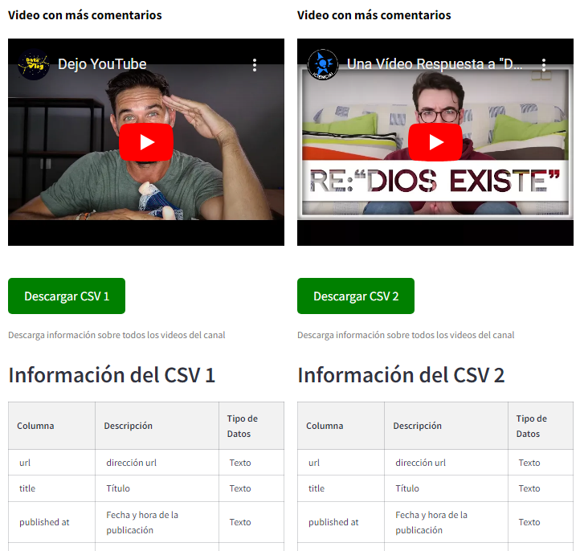

# Proyecto: Extracción de Datos de YouTube

Este proyecto está diseñado para extraer información relevante de canales y videos de YouTube utilizando la **YouTube Data API v3**. Su propósito es facilitar la obtención de datos específicos y estructurarlos en un formato adecuado para su análisis posterior.





## Estructura del Proyecto

### Archivos principales

- **consultas.py**: Contiene las funciones para interactuar con la API de YouTube y extraer datos tanto de canales como de videos. Las funciones principales incluyen:
  - `channel_id_function`: Obtiene el ID de un canal a partir de su URL, permitiendo la flexibilidad de identificar canales por nombre de usuario o ID directo.
  - `get_channel_data`: Recupera estadísticas y metadatos de un canal utilizando su URL.
  - `get_video_data`: Extrae estadísticas y metadatos específicos de un video en YouTube mediante su URL.
  - `get_channel_videos`: Obtiene información de todos los videos de un canal y estructura los datos en un DataFrame de pandas, facilitando el análisis y manipulación de datos a gran escala.


- **keys_1.py**: Archivo que almacena la clave de la API de YouTube (`API_YOUTUBE`), esencial para autenticar las solicitudes a la API. Este archivo no es compartido por temas de seguridad.

### Requisitos y Dependencias

El código depende de las siguientes bibliotecas de Python, que pueden instalarse ejecutando:

```bash
pip install google-api-python-client pandas
```

- **googleapiclient**: Permite la interacción con la API de YouTube.
- **pandas**: Se utiliza para manipular y estructurar los datos extraídos en formatos tabulares.
- **datetime** y **time**: Utilizados para manejar la fecha de consulta y controlar el tiempo de espera entre solicitudes a la API.

## Funcionalidades

1. **Extracción de información del canal**:
   - A través de la URL de un canal, el código obtiene estadísticas clave, incluyendo el nombre, descripción, número de suscriptores, cantidad de videos y vistas totales.
   
2. **Extracción de datos de videos individuales**:
   - Dado un URL de video, la función `get_video_data` obtiene el título, descripción, categoría, número de vistas, comentarios y "me gusta".

3. **Extracción de todos los videos de un canal**:
   - La función `get_channel_videos` recupera la información de todos los videos en un canal específico, asegurando que los datos se mantengan estructurados y listos para un análisis adicional.


## Comportamiento de usuarios

   **Busquedas realizadas**:
   - las búsquedas realizadas son almacenadas en archivos.json para obtener información valiosa de los usuarios de la aplicación 

   

### Ejemplo de Uso

1. Llama a las funciones en `consultas.py` con URLs específicas de canales o videos de YouTube para obtener los datos deseados.
2. Los resultados se devuelven en formatos JSON o como DataFrames de pandas, adecuados para guardar en archivos CSV, bases de datos o lo que se te ocurra.

```python
# Ejemplo básico de llamada a la función get_channel_data
url_canal = "https://www.youtube.com/@tucanaldeyoutubepreferido"
informacion_canal = get_channel_data(url_canal)
print(informacion_canal)
```

## Consideraciones

- **Rate Limiting**: La API de YouTube tiene límites de tasa de solicitudes. Este proyecto incluye pausas (`time.sleep()`) entre solicitudes para evitar superar estos límites y minimizar errores de tasa.

## Futuras Mejoras

- Implementar una interfaz gráfica o un panel en Streamlit para visualizar las estadísticas de forma dinámica.

